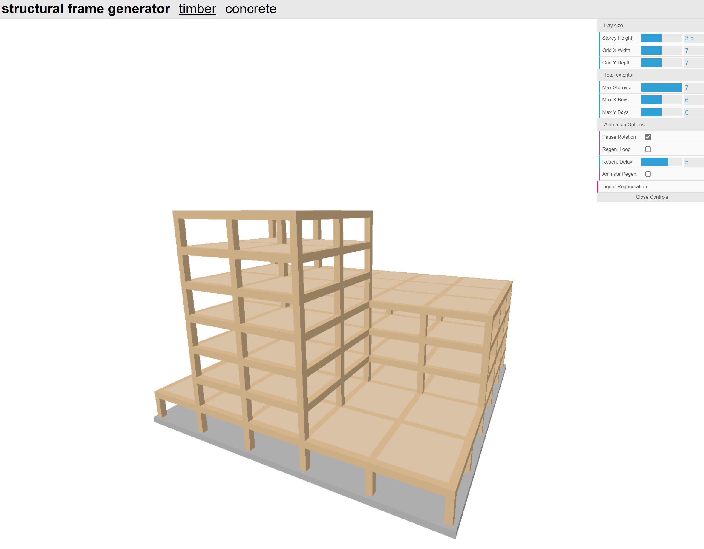

# Voxel Based Structural Frame Generator

A structural frame generator which produces a regular structural frame in timber or concrete, with animation.
Parameters for regeneration (e.g. bax size, number of voxels, animation params) are configurable via a control panel in the upper left corner.

Check it out at the link below:
[https://nickn-eng.github.io/VoxelStructuralFrameGenerator/](https://nickn-eng.github.io/VoxelStructuralFrameGenerator/)



# Preview development build

```
npm run dev
```


# Build for production

```bash
npm run build
npm run preview
```

# Usage

```typescript
//Initialise the frame object into the element of your choice (by elementId)
var frame = new TimberFrame(elementId,
                            animateRegeneration, //Animate regeneration or not? (default true) 
                            regenerationLoop, //Continuously regenerate after an time interval (default true) 
                            regenerationInterval //Time interval in seconds for regeneration (default 5s)
                            );

//Regenerate once to initialise the view
frame.Regenerate();
```
